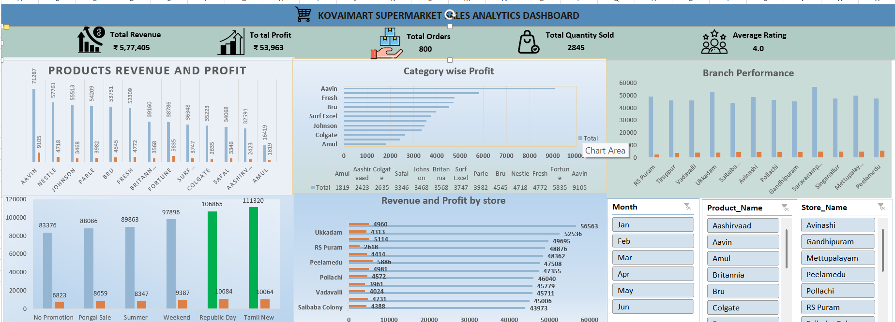

# 🛒 KovaiMart Supermarket Sales Analytics
# Dashboard Preview

## Executive Dashboard




## 📌 Project Overview

The **KovaiMart Supermarket Sales Analytics** project is a Business Analytics consulting assignment designed to analyze supermarket sales data and provide actionable business insights. The objective is to help management understand sales performance, profitability, customer purchasing behavior, and branch performance through an interactive Excel dashboard.

---

## 🎯 Business Objective

Analyze the supermarket sales data to:

* Identify top-performing stores based on revenue and profit.
* Evaluate product and category profitability.
* Measure branch performance.
* Analyze promotional campaign effectiveness.
* Support management with data-driven recommendations.

---

## 👨‍💼 Client Information

* **Client:** KovaiMart Retail Pvt. Ltd.
* **Department:** Sales & Operations
* **Stakeholder:** Regional Sales Manager
* **Role:** Business Analyst

---

## 🛠️ Tools Used

* Microsoft Excel
* Pivot Tables
* Pivot Charts
* Slicers
* Conditional Formatting
* Excel Formulas

---

## 📂 Dataset

The project uses five business datasets:

* **Sales Transactions** – Sales, revenue, profit, customers, payment methods, and promotions.
* **Product Master** – Product details, categories, suppliers, pricing, and profit margins.
* **Store Master** – Store information including location, manager, and operational details.
* **Inventory** – Stock levels, inventory status, and reorder information.
* **Promotions** – Campaign details, discounts, and marketing activities.

---

## 📊 Dashboard Features

### KPI Cards

* Total Revenue
* Total Profit
* Total Orders
* Total Quantity Sold
* Average Customer Rating

### Business Analysis

* Store Performance Analysis
* Product Performance Analysis
* Category Profitability Analysis
* Branch Performance Analysis
* Promotion Performance Analysis

### Interactive Filters

* Month
* Store
* Category
* Payment Mode
* Promotion

---

## 📈 Business Questions Answered

1. Which stores generate the highest revenue and profit?
2. Which products generate high sales but low profit?
3. Which product categories contribute the most to profitability?
4. Which branches require management attention?
5. Which promotional campaigns perform best?

---

## 💡 Key Business Insights

* Identified top-performing stores based on revenue and profitability.
* Compared product sales with profit to identify low-margin products.
* Evaluated category-wise profitability to support inventory and pricing decisions.
* Assessed branch performance to identify improvement opportunities.
* Measured the effectiveness of promotional campaigns on sales performance.

---

## ✅ Business Recommendations

* Focus inventory investment on high-profit product categories.
* Review pricing and supplier costs for products with high sales but low profit.
* Improve operational performance in underperforming branches.
* Plan promotional campaigns around high-demand periods.
* Continuously monitor KPIs using the interactive dashboard.

---

## 📁 Repository Structure

```text
KovaiMart-Supermarket-Sales-Analytics/
│
├── data/
│   ├── raw/
│   └── cleaned/
│
├── analysis/
│
├── dashboard/
│
├── presentation/
│
├── README.md
│
└── screenshots/
```

---

## 📷 Dashboard Preview

> Add your Excel dashboard screenshot inside the **screenshots** folder and update this section with the image.

---

## 🚀 Project Outcome

This project demonstrates practical Business Analyst skills, including:

* Data Cleaning
* Data Analysis
* Excel Dashboard Development
* Business KPI Reporting
* Business Insight Generation
* Decision Support through Data Visualization

---

## 👩‍💻 Author

**Yogalakshmi M**

**Skills:** Excel | SQL | Power BI | Python | Data Analytics

Thank you for visiting this project. Feedback and suggestions are always welcome.
